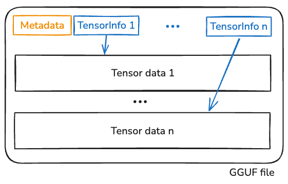
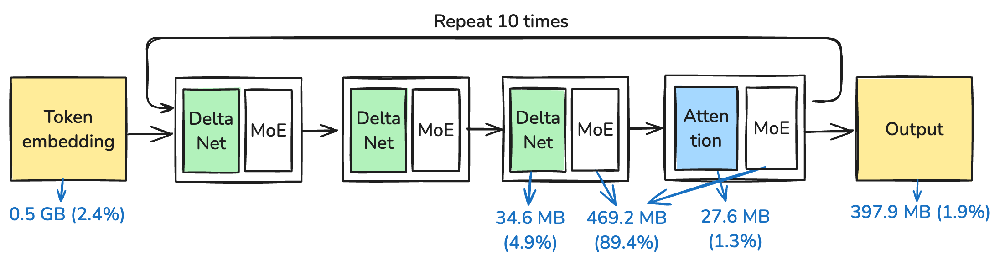
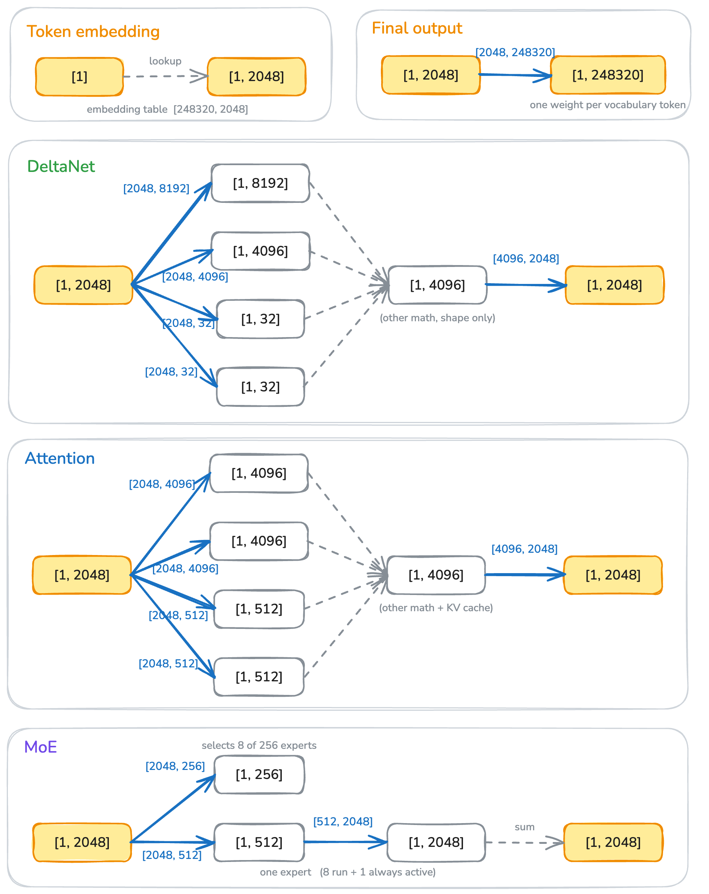
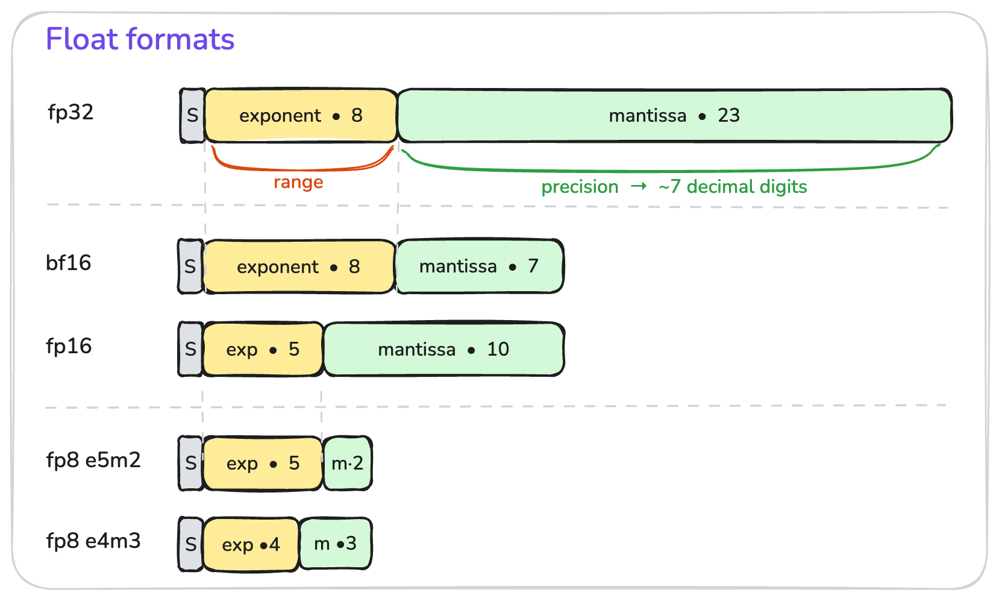
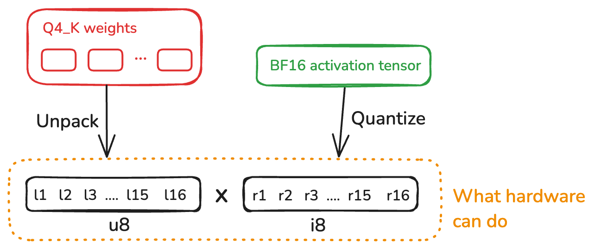

LLM has become so important that I need to know more about it.
The best way to learn more is to build it.

In this blog post, I'll build a tiny LLM inference engine without any dependencies in Rust.

We pick the model [`Qwen3.6-35B-A3B-UD-Q4_K_M.gguf`](https://huggingface.co/unsloth/Qwen3.6-35B-A3B-MTP-GGUF) so that it runs on most machines but also complex enough to be "modern llm" [^1].
This is also the only model we support here.
The end result is that we will be able to run the prefill at 100 tokens/s and the decode at 15 tokens/s, both saturating the hardware limit.

[^1]: the model was released in April 2026.

I don't like to write the code in minimal lines of code, because it's LLM write them anyway, who cares about lines of code? 
But we do care about the code structure and the beauty of the design.

This blog covers most of the important parts of a local LLM inference engine:

1. The LLM architecture 
1. Quantization
2. Fast matrix multiplication
3. KV cache

This blog does not cover:

1. GPU acceleration, this is a pure CPU inference engine. GPU is planned for future work.
2. No MTP (speculative decoding), because we are not GPU yet.
3. Things that are {vendor-specific | closed-source}, e.g., CUDA.

## How to read the name? Qwen3.6-35B-A3B-UD-Q4_K_M.gguf

**Qwen** (pronounced /kwen/) is the model family name, it is from Alibaba, a not so popular Chinease company (in tech world).

**3.6** is the version number, before it was 3.5, then 3, so it has been around for a while.

**35B** is the model size. 35 **B**illion is the number of parameters, if each parameter is 8 bits (fp8, or int8), then the model size is about 35GB.

**A3B** means the model **a**ctivates **3** billion parameters to generate a token. It also means the model is an MoE (Mixture of Experts) model, which is different from dense models where all parameters are activated all the time.

**UD-Q4_K_M** means the model is **q**uantized to **4** bits (Q4), and K_M are quantization schemes (as you may guess there're many ways to quantize a model). UD means the model is [unsloth dynamic quantization](https://unsloth.ai/docs/basics/unsloth-dynamic-2.0-ggufs). Unsloth is a company that does the quantization work.

**gguf** is the model file format. Unlike formats like [`safetensors`](https://huggingface.co/docs/safetensors/index), [`gguf`](https://github.com/ggml-org/ggml/blob/master/docs/gguf.md) is a self-sufficient format that a single file contains all you need to run the model, but really, it's just some metadata and the model weights.

## What's inside the file?

The file format is pretty boring (as intended), it's basically a metadata to say what the model is, and pairs of tensor info and tensor data, as shown in @fig-gguf-layout.

{#fig-gguf-layout width=50%}

The tensor info is stored at the begining of the file, and it points to the actual tensor data through the `offset` and `len` fields:
```rust
struct TensorInfo {
    name: String, // e.g., `blk.3.attn_norm_weight`
    shape: Vec<u64>,
    dtype: u32,
    offset: u64,
    len: u64,
}
```
Note that `dtype` is a per-tensor field, which implies that two tensors in the same file may have different data types (i.e., how to quantize the tensor). 
This allows some important tensors (e.g., the weights of the embedding) to be stored with more bits (so higher precision), while the rest can be quantized more aggressively.
As you may guess, per-tensor quantization is a fine art.

A closer look at the quantization schemes shows that the model has 6 different types of tensors, more than half of the bytes are quantized to Q4_K:
```
  BF16      2 tensors         1.00 MB
  F32     368 tensors        99.78 MB
  Q4_K     82 tensors     11808.00 MB
  Q5_K     38 tensors      6688.00 MB
  Q6_K      4 tensors      1027.85 MB
  Q8_0    259 tensors      1978.38 MB
  ------ ---- ---------    ----------
  total   753 tensors     21603.01 MB
```


The metadata says a few other things about the model, such as the number of layers, the model family, etc, which is used to describe the model architecture.

## The model architecture

The model metadata describes architecture details, and it belongs to the Qwen3 next family of models, its architecture and the history can be found [here](https://magazine.sebastianraschka.com/p/the-big-llm-architecture-comparison#§121-expert-size-and-number-of-attention-heads).

@fig-model-arch is a simplified version of the model architecture and its weights distribution.
For every token, the model has to find a way to convert it into a embedding vector (with dimension 2048 for this model), and it needs to go through a few layers of computation to get the final output.

Qwen3.6 is not a typical transformer, it mixes the so called `DeltaNet` with the conventional `Attention` layers with 3:1 ratio. We will get to the details later, the high level intuition is that attention layer's state (i.e., the KV cache) is quadratic in the number of tokens, while delta net's state is linear, this helps the model to scale to longer context.

All qwen3.6 family models follow the same architecture, except that larger models have more layers (e.g., 20 layers instead of 10) and deeper model dimensions (e.g., 5120 instead of 2048).

{#fig-model-arch width=100%}

Table below shows the more detailed weights distribution:

```
  Group                            Params         Stored    Share
-----------------------------------------------------------------
  Token embedding                508.56 M     515.31 MiB    2.44%
  DeltaNet layers                  1.01 B       1.01 GiB    4.92%
  Attention layers               272.66 M     276.35 MiB    1.31%
  MoE blocks                      32.36 B      18.43 GiB   89.44%
  Final output                   508.56 M     397.86 MiB    1.89%
-----------------------------------------------------------------
  Reported total                  34.66 B      20.60 GiB  100.00%
```

MoE blocks are the biggest player here, it occupies 89.4% of the model size, and each MoE block is 469.2 MB.
However, each MoE block only activates 1/32 of the parameters, while rest of the parameters are activated all the time, so each token needs to activate 0.508M + 1.01B + 272.66M + **32.36B/32** + 0.508M ~= 3B parameters, where the 3B in the name "A3B" comes from.

There're two stages of a LLM inference: prefill and decode.
Prefill loads the model once, and initialize the states (e.g., the KV cache), potentially thousands of tokens, which is often compute bound.
Decode generates tokens one by one, each time it needs to load the model again, which is often memory bound.
We will discuss them in detail later.

## Token <--> String

Token is a LLM-specific representation of a string, it's not foundamentally different from other representations like ASCII or UTF-8, where `42` means `*` (in ASCII) and `U+1F3D4` means `🏔️` (in Unicode). 

The first thing to look at is the vocabulary table, which is stored in `tokenizer.ggml.tokens` metadata, which is a list of strings.
The first 8 tokens of this model are: [`!`, `\`, `#`, `$`, `%`, `&`, `'`, `(`].
This means that 0 refers to `!`, and 7 refers to `(`, and vise versa.

Note that different models may have different vocabulary tables.
Smaller vocabulary means more tokens are needed to represent the same set of strings.
Modern LLM tends to have a larger vocabulary, this model has 248,320 vocabulary tokens, which means it needs u32 to represent the token index (u16::MAX is 65,535).[^2]

[^2]: Anthropic changed their tokenizer in Opus 4.7, which caused [1.46x more tokens](https://simonwillison.net/2026/Apr/20/claude-token-counts/) with the same input.

#### From token to string

From token to string is easy. Given a list of tokens, we simply lookup the strings from the vocabulary and concatenate them.

One caveat in streaming output is that one token may be just a partial symbol, which requires a buffer to store multiple tokens before a symbol can be displayed, this happens to unicode symboles more often. 

#### From string to token

From string to token is more complicated, but not foundamentally different from how string compression works. We start with each byte in the input string will correspond to one token, this is by design, and avoids unrepresentable characters.

Then we apply a few rules to merge tokens, the goal is to pioritize tokens with longer squences, which reduces the total number of tokens. 


<details>
<summary>Actually there's more details to consider</summary>
1. Pre-processing a string to setences. There's a thing called pre-tokenizer, which tries to split a long string into multiple smaller chunks, so that we don't have tokens that have werid split patterns, e.g., a token that span across two Chinese characters.
2. It runs a bpe merge of adjacent tokens, which is quite expensive, but reduces the total number of tokens.
3. Chat templates requires some special tokens like <|system|>, <|user|>, <|assistant|>, etc. When model sees these tokens, it has better semantics of the conversation.
</details>

Roughly speaking, an LLM is a function that 

```rust
fn inference(input: Vec<u32>) -> u32
```

## The life of a tensor 

Once we have the input tokens, the next step is to predict the next token. 

There're lots of algorithms and math invovled in this step, but honestly, you don't have to know much about it, you can think of it as a chain of matrix multiplications. 
It's great that you know what is RoPE, QKV, softmax, RMSNorm, etc., but from inference perspective, we don't really care, knowing them also doesn't help. 

What really matters is the shape of the tensors, because that determines the compute and memory requirements.

{#fig-tensor-life width=90%}

@fig-tensor-life shows the life of a tensor, the blue arrow shows the matrix multiplication, grey arrow shows other math, like normalization, softmax, etc.

The first we need to care is the embedding table, which is a 2D tensor of shape [vocabulary_size, embedding_dim], in this case, it's [248320, 2048].
Converting a token to an embedding is a simple lookup to slice a [1, 2048] tensor.
This [1, 2048], usually called the activation tensor, is the input and also the output of the rest of the layers.

The final output convert the [1, 2048] tensor to a [1, 248320] tensor, giving a weight to each token in the vocabulary. We can pick the token with the highest weight as the next token, or use a sampling algorithm like top-k to get variations.

The rest of the blocks, i.e., attention, delta net, and the moe blocks, all take [1, 2048] as input and [1, 2048] as output, internally it's a chain of matrix multiplications with some supplementary math like normalization, softmax, etc.

The above case discuss a single token, which is the case of decode, for prefill, it's really the same, except that it's not [1, 2048], but [n, 2048]. The rest of the math is the same.

Note that a matrix multiply with `[1, 2048]` (as in the decode case) is usually called "GEM**V**" (General Matrix **Vector** Multiplication), while a matrix multiply with `[n, 2048]` (as in the prefill case) is usually called "GEM**M**" (General Matrix **Matrix** Multiplication). The math is identical but the implementation is completely different, because shape matters.
GEMV is memory bound, because each weight is loaded once, multiplied with one activation, and never reused, the matrix is streamed row by row from RAM.
GEMM is often compute bound, because each weight is now reused across `n` activation columns. Once `n` is large enough that we can keep a weight tile in registers / L1 and sweep it across multiple output columns, the arithmetic intensity goes above the machine's compute-to-bandwidth ratio, and the FPU becomes the bottleneck.

## Reading the first tensor

In an ideal world, every tensor is a simple f32 tensor, and matrix multiplication is simple and well optimized.

But f32 is too expensive, for our 35B model, if everything is f32, we need 35B * 4 = 140GB of memory.
Additionally, it turns out that f32 is quite overkill for practical LLM inference, we can downscale the precision to 8 bits with almost no loss of accuracy, and it turns out that even 4 bits can retain most of the information.

Using smaller bits to represent weights not only reduces the memory footprint, but often makes the compute faster, especially for GEMV, where the memory bandwidth is the bottleneck, less memory to load means faster.

But this makes the computation more complicated, especially that the file contains a mix of different quantization schemes, but we will get to that later.

As discussed above, the model has six types of tensors, here we only discuss two representative ones: `Q8_0` and `Q4_K`.

### Q8_0 block

@fig-q8-0 shows a `Q8_0` block, it's the simplest quantization scheme, we take a f32 precision value, and devide by a scale value, then round to the nearest integer. Dequantization is the reverse, we simply multiply the quantized value by the scale value.
The scale is calculated to be the maximum absolute value divided by 127, so that the quantized values are in the range [-127, 127].

{#fig-q8-0 width=80%}

### Q4_K block

`Q4_0` is similar to `Q8_0`, except that it uses 4 bits as the weight precision, and in fact `Q4_0` is also widely used in practice. But there're two problems with `Q4_0`.

The first problem is that it assumes the weights are symmetrically distributed around 0, which is not always the case. Consider if all weights are positive, and we still use `int8` to represent them, we then waste half of the precision.
Consider when all weights are positive, and we still use `int8` to represent them, we then waste half of the precision.
To fix this, we simply shift the weights by the minimum value, so that the weights are all non-negative, and use unsigned integer to represent them.

But this means that we need to store two f16 values: the scale and the min, and if only 32 weights share the same scale and min, it's wasteful; if more weight share the same scale and min, we can easily have one outlier that dominates the scale, causing inbalanced quantization.

@fig-q4-k shows the key idea behind `Q4_K`: each 32 weights (sub-block) has a pair of scale and min, it then uses a super block to quantize the scale and the min, so that each scale and min only costs 6 bits (instead of 16 bits), and we can pack 8 pairs of them into 12 bytes, and finally have f16 precision for the super-block's scale and min.

{#fig-q4-k width=90%}

### fp32 vs fp16 vs bf16 vs fp8?

Now it's a good time to talk about fp16 [^3] and bf16.

[^3]: fp16 is sometimes called f16.

As @fig-float-formats shows, they are really simple: every floating number has three parts: sign, exponent, and mantissa.
The exponent controls the range of the value, the mantissa controls the precision.

`bf16` and `fp16` are two different ways to cut `fp32` in half: `bf16` keeps 8-bit exponent (so it has the same range, but loses precision), but `fp16` shrinks the exponent to 5 bits (so it has a smaller range, but keeps more precision).
Similarly, `fp8 E5M2` keeps 5-bit exponent, while `fp8 E4M3` gives up another exponent bit to save precision.

{#fig-float-formats width=80%}

Use `fp16` when you need more precision, like the case in our `Q4_K` block; use `bf16` when you don't want to worry about overflow, popular for LLM training.

There's something special about `bf16`: it's almost trivial to convert between `bf16` and `fp32`: just shift the bits left/right by 16 bits.

## Matrix multiplication

Now comes the elephant in the room: matrix multiplication.

Before we judge any approach, let's first build a mental model of what performance we should expect. For two matrices `[a, b]` and `[b, c]`, it's not too hard to see that:
```text
Optimal compute: 2 * a * b * c = 2abc FLOPs
Optimal memory: ab + bc + ac
```
We have to read both inputs once, write the output once, and do `b` multiply-adds for each of the `a*c` output entries. Anything more than this is overhead.

### Naive dequant-then-multiply is bad

The simplest way is to dequantize both sides to fp32, run the good old GEMM, and quantize the result back. This works, but it throws away most of what we got from quantization. Every 0.5-byte `Q4_K` weight expands to 4 bytes of fp32 traffic before we even start multiplying, that's an 8x blowup of the memory we worked so hard to compress. On top of that we pay `~2 * (ab + bc)` extra FLOPs for the dequantization itself.

For GEMV this is catastrophic, because GEMV is memory bound. If we expand weights to fp32 we're back to where we started before quantizing anything. So we want to multiply directly on the quantized weights, without ever materializing fp32 in between.

### Picking the activation format

The weights are pre-quantized in the file, but the activation tensor (`[1, 2048]` for decode, `[n, 2048]` for prefill) is computed at runtime, so we get to choose its format.

`bf16` is the natural carrier between layers: same range as fp32, half the size, and softmax/norm are happy with it. But it's not the right format inside the matmul itself, because no CPU has a native `bf16 × q4` multiplier.

The instruction we do have, on both AVX-VNNI (`vpdpbusd`) and ARM (`vdotq_s32` / `i8mm`), is the **integer dot product**: `u8 × i8 → i32`, vectorized over 16 lanes at a time. So inside the matmul we want both operands as 8-bit integers:

- `Q4_K` weights are 4-bit unsigned, unpacking each nibble into a `u8` is basically free.
- Activations need to be `i8`, so we quantize bf16 to `Q8_K`. Its 256-weight super-block lines up exactly with `Q4_K`, and `Q8_K` also caches per-sub-block sums of the activation, which we'll see in a moment is exactly what we need.

### The smart 

Now we can narrow the problem down to this: **we have a 32-weight sub-block of `Q4_K` and the matching sub-block of `Q8_K`, how do we efficiently dot product?**

For `Q4_K` each dequantized weight is $w_l = q_l \cdot s_l - m_l$, where $q_l$ is `u8` and $s_l, m_l$ are fp32 scales reconstructed from the 6-bit packed sub-block scales and the super-block's fp16 `d` and `dmin`. For `Q8_K` each activation is $w_r = q_r \cdot s_r$, Q8 is symmetric so there's no min term.

The dot product over the sub-block expands as:

$$
\sum_{i=0}^{31} w_l[i] \cdot w_r[i]
\;=\; s_l \cdot s_r \cdot \underbrace{\sum_i q_l[i] \cdot q_r[i]}_{\text{u8 × i8 integer dot}}
\;-\; m_l \cdot s_r \cdot \underbrace{\sum_i q_r[i]}_{\text{i8 sum, precomputed by Q8\_K}}
$$

Two integer reductions, then two multiply-adds in fp32. The expensive part, the 32-term dot product, never leaves integer land, exactly what the SIMD instruction is good at. The second term, $\sum q_r$, is already cached inside the `Q8_K` block (the `bsums` field) when we quantized the activation, so it's just a load, not a runtime reduction. This is the whole reason `Q8_K` exists.

### Putting it together

Honestly you don't need to understand every details here, the key is to know that there's a storage reality -- weights are quantized to save memory, and there's a compute reality -- hardware can only do certain operations in certain shapes.

The goal of everything we talked about is to make a delicate balance: nudge the both sides of formats a bit, choose a right instruction set to be both efficient and without too much overhead.

{#fig-matrix-mat width=80%}

## The state: KV Cache and DeltaNet states

As a system programmer, I don't like the name "KV Cache", it sounds like a KV store (e.g., Redis) but it's not key or value; here the K and V are the name of two matrices.

Remember we said llm inference is a function that looks like this:
```rust
fn inference(input: Vec<u32>) -> u32
```
Meaning that the inference function is stateless, where does the state come from?
Well, because we're not just generating a single token, but a sequence of tokens, it looks more like this:

```rust
loop {
  token = inference(input);
  input.push(token);
  if token == EOF {
    break;
  }
}
```
This means that each inference adds one token to the input, as we generate more tokens, the inference has to process longer input.

todo.

## Performance 

### Fuse kernels

Fusing kernels is basically to combine two operations into one, this either reduces memory traffic or use better instructions.
For example, multiply-then-add can be fused into a single instruction.

### SIMD instructions

In the matrix multiplication, we already used SIMD instructions to vectorize the computation.

Generally speaking, there're two popular ways to leverage SIMD instructions:
1. auto vectorization by the compiler. LLVM does a pretty good job here. 
2. explicit simd instructions. auto vectorization is a black box, there are two reasons it doesn't work: 1. compiler is conservative, it may or may not use the instructions we wanted, 2. we write code in a pattern that the compiler doesn't recognize. I often prefer explicit SIMD instructions, because for performance critical code, you really want to know what's exactly being used.

A explicit SIMD code looks like this. It looks intimidating at first, but it's really just a combination of load, multiply, add, and reduce instructions, and you don't need to write your own, ask codex to do it for you.

```rust
for n in 0..n_rows {
    let x = &act[base + n];
    let mut av = _mm512_setzero_si512();
    for p in 0..4 {
        let xv = _mm512_loadu_si512(x.qs.as_ptr().add(p * 64) as *const __m512i);
        let dp = _mm512_dpbusd_epi32(_mm512_setzero_si512(), w[p], xv);
        av = _mm512_add_epi32(av, _mm512_mullo_epi32(dp, s16[p]));
    }
    let acc_scaled = _mm512_reduce_add_epi32(av);
    let pairs =
        _mm256_madd_epi16(_mm256_loadu_si256(x.bsums.as_ptr() as *const __m256i), ones);
    let acc_min = hsum_i32_256(_mm256_mullo_epi32(pairs, mnv));
    acc[n] += x.d * (d * acc_scaled as f32 - dmin * acc_min as f32);
}
```


### Multi-threading

Multi-threading here is not different from other systems, and the first thing to consider is how to partition the work.
The simplest way is to partition the work by number of users, i.e., each user has a thread which runs the entire inference from start to end.

A more interesting question to ask is what is the lowest inference latency we can achieve, from the perspective of a user, i.e., time-to-first-token.
To optimize this, we need to parallelize within a single inference.

The cost model here: creating a thread costs (?) time, so we want to have a thread pool to avoid creating and destroying threads too often.
Contention on the same memory is bad, so we want to partition our work so that each thread works on their own working set.

### How did we do?

My machine can do 55GB/s memory bandwidth, and that's the goal we should strive for.

Table below shows the overall end to end performance, and per kernel performance.
The biggest two kernels are `qmatmul` and `moe_routed_experts`, and their effective bandwidth is already close to the hardware limit, we have done a good job.

```text
bench: model/Qwen3.6-MTP-35B-A3B-UD-Q4_K_M.gguf
cpu:
  load:    3.46s
  prefill: 256 tok in 2.176s — 117.7 tok/s
  decode:  64 tok in 4.234s — 15.1 tok/s (66.1 ms/tok)

------------------------------------------------------------------------------
  kernel                    count        total          bytes       eff bw
------------------------------------------------------------------------------
  qmatmul                    9024    2282.582ms   113837932544      49.87 GB/s
  moe_routed_experts         2560     815.111ms    39158022144      48.04 GB/s
  moe_shared_expert          2560     309.055ms     8577351680      27.75 GB/s
  attention                   640     272.661ms     3040870400      11.15 GB/s
  delta_rule_scan            1920     172.020ms    24238080000     140.90 GB/s
  moe_router                 5120     168.570ms     5413283840      32.11 GB/s
  causal_conv1d_silu         1920      82.260ms      660602880       8.03 GB/s
  gdn_gates                  1920      65.658ms      755466240      11.51 GB/s
  add_rmsnorm                5120      21.565ms      104857600       4.86 GB/s
  qk_norm_rope               1280       5.234ms       17694720       3.38 GB/s
  embed_rmsnorm                64       0.297ms         663552       2.23 GB/s
  append_kv                   640       0.216ms        2621440      12.11 GB/s
  slice_last_row               64       0.021ms         524288      25.26 GB/s
```

## Source code

Honestly, nobody is going to read and use this source code, just send codex this blog post and ask it to write a inference engine for you. 

The goal of this blog post is to help _you_ (as a human being) to understand one layer below the LLM inference engine, so that you can be not so afraid of the code generated by codex/claude.


