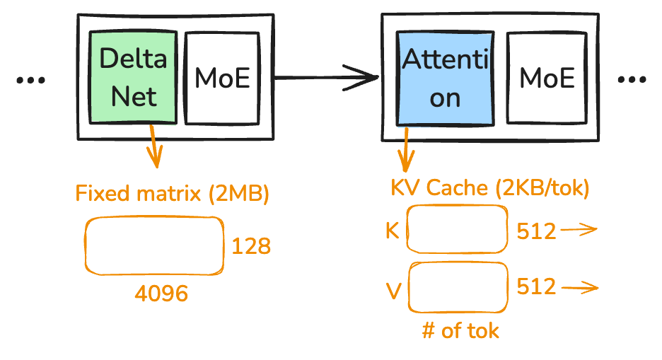

::: {.callout-warning appearance="simple" icon=false}
## Acknowledgments

Let's take a moment to thank my PhD sponsors: [InfluxData](https://influxdata.com), [Bauplan](https://www.bauplanlabs.com), [SpiralDB](https://spiraldb.com), and the taxpayers of the State of Wisconsin and the federal government.
:::


LLMs have become so important that I (probably you as well) want to understand them better, and the best way to learn is to build one.

In this blog post, I'll share what I've learned about LLM inference, from the perspective of a systems programmer.

I pick the model [`Qwen3.6-35B-A3B-UD-Q4_K_M.gguf`](https://huggingface.co/unsloth/Qwen3.6-35B-A3B-MTP-GGUF) so that it runs on most machines but is also complex enough to count as a "modern LLM" [^1].
This is the only model to support here.
By the end, we'll be able to run prefill at 100 tokens/s and decode at 15 tokens/s, not so bad on a CPU-only machine.

[^1]: The model was released [in April 2026](https://www.marktechpost.com/2026/04/16/qwen-team-open-sources-qwen3-6-35b-a3b-a-sparse-moe-vision-language-model-with-3b-active-parameters-and-agentic-coding-capabilities/).

This blog covers most of the important parts of a local LLM inference engine:

1. The LLM architecture
2. Quantization
3. Fast matrix multiplication
4. KV cache

But does not cover:

1. GPU acceleration, this is a pure CPU inference engine. I'll probably do a GPU follow up later. 
2. No MTP (speculative decoding), because we are not GPU yet.
3. Things that are {vendor-specific | closed-source}, e.g., CUDA, are not covered

## How to read the name? Qwen3.6-35B-A3B-UD-Q4_K_M.gguf

**Qwen** ([pronounced /kwɛn/](https://en.wikipedia.org/wiki/Qwen), like "when" with a "kw") is the model family name; it comes from Alibaba,  a not so popular Chinese company (in tech world).

**3.6** is the version number; previous versions were 3.5 and 3, so the family has been around for a while.

**35B** is the model size. 35 **B**illion is the number of parameters; if each parameter were 8 bits (fp8 or int8), the model would be about 35 GB.

**A3B** means the model **a**ctivates **3** **B**illion parameters to generate a token. It also implies the model is an MoE (Mixture of Experts) model — unlike dense models where all parameters are activated for every token.

**UD-Q4_K_M** means the model is **q**uantized to **4** bits (Q4), and `K_M` is the quantization scheme (there are [many ways to quantize](https://github.com/ggml-org/llama.cpp/wiki/Tensor-Encoding-Schemes) a model). `UD` stands for [Unsloth Dynamic quantization](https://unsloth.ai/docs/basics/unsloth-dynamic-2.0-ggufs); Unsloth is a company that produces these quantized variants.

**gguf** is the model file format. Unlike [`safetensors`](https://huggingface.co/docs/safetensors/index), [`gguf`](https://github.com/ggml-org/ggml/blob/master/docs/gguf.md) is a self-contained format: a single file holds everything you need to run the model. In practice, it's just metadata plus the model weights.

## What's inside the file?

The file format is pretty boring (as intended): some metadata describing the model, followed by pairs of tensor info and tensor data, as shown in @fig-gguf-layout.

{#fig-gguf-layout width=50%}

The tensor info is stored at the beginning of the file, and points to the actual tensor data through the `offset` and `len` fields:
```rust
struct TensorInfo {
    name: String, // e.g., `blk.3.attn_norm_weight`
    shape: Vec<u64>,
    dtype: u32,
    offset: u64,
    len: u64,
}
```
Note that `dtype` is a per-tensor field, which means two tensors in the same file may use different data types (i.e., different quantization schemes).
This lets us store important tensors (e.g., the embedding weights) with more bits for higher precision, while quantizing the rest more aggressively.
As you might guess, per-tensor quantization is a fine art.

A closer look at the quantization schemes shows that the model has 6 different types of tensors, more than half of the bytes are quantized to Q4_K:
```
  BF16      2 tensors         1.00 MB
  F32     368 tensors        99.78 MB
  Q4_K     82 tensors     11808.00 MB
  Q5_K     38 tensors      6688.00 MB
  Q6_K      4 tensors      1027.85 MB
  Q8_0    259 tensors      1978.38 MB
  ------ ---- ---------    ----------
  total   753 tensors     21603.01 MB
```


The metadata also encodes the model architecture: the number of layers, the model family, and so on.

## The model architecture

The model belongs to the [Qwen3-Next family](https://huggingface.co/Qwen/Qwen3-Next-80B-A3B-Instruct); for background on the architecture lineage, see [Sebastian Raschka's "Big LLM Architecture Comparison"](https://magazine.sebastianraschka.com/p/the-big-llm-architecture-comparison).

@fig-model-arch is a simplified view of the architecture and its weight distribution.
For every input token, the model first converts it into an embedding vector (with dimension 2048 for this model), then runs it through several layers of computation to produce the final output.

Qwen3.6 is not a typical transformer: it mixes the so-called `DeltaNet` layers with conventional `Attention` layers at a [3:1 ratio](https://vllm.ai/blog/2025-09-11-qwen3-next). We will get to the details later; the high-level intuition is that attention's per-token state (the KV cache) grows linearly with sequence length and its compute is quadratic, while DeltaNet's state is fixed-size — this helps the model scale to longer context.

All Qwen3.6 family models share this architecture; larger members of the family scale by adding more layers and using a wider hidden dimension (e.g., the Qwen3-Next-80B variant has 48 layers and a 2048 hidden dim).[^arch-note]

[^arch-note]: Qwen3.6-35B-A3B has 40 layers organized as 10 repetitions of (3 DeltaNet + 1 Attention) blocks, so 30 DeltaNet layers and 10 Attention layers. See [the apxml spec page](https://apxml.com/models/qwen36-35b-a3b).

{#fig-model-arch width=100%}

Table below shows the more detailed weights distribution:

```
  Group                            Params         Stored    Share
-----------------------------------------------------------------
  Token embedding                508.56 M     515.31 MiB    2.44%
  DeltaNet layers                  1.01 B       1.01 GiB    4.92%
  Attention layers               272.66 M     276.35 MiB    1.31%
  MoE blocks                      32.36 B      18.43 GiB   89.44%
  Final output                   508.56 M     397.86 MiB    1.89%
-----------------------------------------------------------------
  Reported total                  34.66 B      20.60 GiB  100.00%
```

MoE blocks dominate: they account for 89.4% of model size, and each MoE block is roughly 469 MB.
However, each MoE block only activates 1/32 of its parameters (8 of 256 experts per token), while the other components fire for every token. So each token activates approximately 0.508B + 1.01B + 273M + **32.36B / 32** + 0.508B ≈ 3.3B parameters, which rounds to the "3B" in "A3B".[^a3b-count]

[^a3b-count]: The official "3B active" figure is computed slightly differently — see the [Qwen3.6 model card](https://huggingface.co/Qwen/Qwen3.6-35B-A3B). The ballpark is the same.

There are two stages of LLM inference: prefill and decode.
Prefill processes the input prompt (potentially thousands of tokens) in a single forward pass and populates the per-layer state (KV cache, DeltaNet state). It is usually compute-bound.
Decode generates tokens one at a time, and on each step the full weight matrix must be streamed through the FPUs again, so it is usually memory-bound.
We'll come back to this distinction later.

## Token <--> String

A token is an LLM-specific representation of a string. It isn't fundamentally different from other representations like ASCII or Unicode, where `42` means `*` (in ASCII) and `U+1F3D4` means `🏔` (in Unicode).

The first thing to look at is the vocabulary table, stored in the `tokenizer.ggml.tokens` metadata field as a list of strings.
The first 8 tokens of this model are: [`!`, `\`, `#`, `$`, `%`, `&`, `'`, `(`].
So token id 0 refers to `!`, id 7 refers to `(`, and so on.

Note that different models may have different vocabulary tables.
A smaller vocabulary means more tokens are needed to represent the same string.
Modern LLMs tend to have larger vocabularies — this model has 151,936 vocabulary tokens, which exceeds `u16::MAX` (65,535), so the token index must be `u32`.[^2]

[^2]: Anthropic changed their tokenizer in Opus 4.7, which produces [1.46× more tokens](https://simonwillison.net/2026/Apr/20/claude-token-counts/) on the same text input — a hidden ~46% price hike at the same per-token rate.

#### From token to string

Token-to-string is easy: look up each token in the vocabulary and concatenate the strings.

The one caveat is streaming output: a single token may represent only a partial UTF-8 sequence, so the decoder needs to buffer bytes until a complete codepoint can be emitted. This is especially common with non-ASCII scripts and emoji.

#### From string to token

String-to-token is more involved, but conceptually similar to how dictionary-based compression works. We start with the property that every byte in the input string has a single-token representation — by design — which guarantees that any input is representable.

Then we apply [byte-pair encoding (BPE)](https://en.wikipedia.org/wiki/Byte_pair_encoding) merge rules; the goal is to greedily merge adjacent tokens into the longest sequences the vocabulary supports, which reduces the total token count.


<details>
<summary>Actually there are more details to consider</summary>
1. **Pre-tokenization.** A pre-tokenizer first splits the input into smaller chunks (along whitespace, punctuation, digits, etc.) so that downstream BPE merges don't span boundaries we'd prefer to keep separate — e.g., a single token that straddles two Chinese characters.
2. **BPE merge.** We then run a BPE merge over adjacent tokens. It is comparatively expensive but reduces the total token count substantially.
3. **Chat templates.** Special tokens like `<|im_start|>`, `<|im_end|>`, etc., delimit roles in a conversation; the model uses these to recognize turn structure.
</details>

Roughly speaking, an LLM is a function:

```rust
fn inference(input: Vec<u32>) -> u32
```

## The life of a tensor

Once we have the input tokens, the next step is to predict the next token.

There are lots of algorithms and math involved, but honestly, you don't need to know most of it — you can think of inference as a chain of matrix multiplications.
Knowing what RoPE, QKV, softmax, RMSNorm, etc. *do* is cool to talk about, but from an system programmer's perspective it doesn't really matter.

What matters is the **shape of the tensors**, because that determines the compute and memory requirements.

{#fig-tensor-life width=90%}

@fig-tensor-life shows the life of a tensor; blue arrows are matrix multiplications, grey arrows are auxiliary math like normalization and softmax.

The first thing to care about is the embedding table, a 2D tensor of shape `[vocabulary_size, embedding_dim]`, in this case `[151936, 2048]`.
Converting a token to an embedding is a simple lookup: slice out one row to get a `[1, 2048]` tensor.
This `[1, 2048]`, usually called the activation tensor, is both the input and the output of every subsequent layer.

The final output projection converts the `[1, 2048]` activation into a `[1, 151936]` tensor, assigning a logit to each token in the vocabulary. We can pick the token with the highest logit as the next token, or use a sampling algorithm like top-k / top-p / temperature sampling to get variation.

The rest of the blocks — attention, DeltaNet, and the MoE blocks — all take `[1, 2048]` as input and produce `[1, 2048]` as output; internally each is a chain of matrix multiplications with some supplementary math like normalization and softmax.

The above describes a single token (the decode case); prefill is the same except the activation is `[n, 2048]` rather than `[1, 2048]`. The math is unchanged.

## Reading the first tensor

In an ideal world, every tensor would be a simple f32 tensor, and matrix multiplication would be simple and well-optimized.

But f32 is too expensive: for our 35B model, going all-f32 would require 35B × 4 = 140 GB of memory.
On top of that, f32 is overkill for practical LLM inference — we can drop to 8 bits with almost no loss of accuracy, and even 4 bits retains most of the information.[^quant-quality]

[^quant-quality]: Q4_K_M typically [retains ~92% of the original FP16 model's quality](https://vucense.com/dev-corner/gguf-quantization-explained-q4-k-m-vs-q8-0-vs-f16-2026/) at roughly 25% of the bytes; Q8_0 is "essentially lossless" with perplexity drift around 0.01.

Using fewer bits per weight not only reduces the memory footprint but often makes compute *faster*, especially for GEMV, where memory bandwidth is the bottleneck — less data to load means a shorter critical path.

The flip side is that the matmul itself gets more complicated, especially since the file contains a mix of quantization schemes. We'll come back to that.

As listed earlier, the model has six tensor types; here we only discuss two representative ones: `Q8_0` and `Q4_K`.

### Q8_0 block

@fig-q8-0 shows a `Q8_0` block. It's the simplest quantization scheme: take an fp32 value, divide by a scale, and round to the nearest integer. Dequantization is the reverse — multiply the quantized value by the scale.
The scale is chosen as `max(|w|) / 127`, so the quantized values land in `[-127, 127]`.
Each block holds 32 weights plus a single fp16 scale, packed into 2 + 32 = 34 bytes ([source: llama.cpp `block_q8_0` definition](https://github.com/ggml-org/llama.cpp/wiki/Tensor-Encoding-Schemes)).

{#fig-q8-0 width=80%}

### Q4_K block

`Q4_0` is similar to `Q8_0`, except it uses 4 bits per weight; in fact `Q4_0` is also widely used. But it has two problems.

The first problem is that it assumes weights are symmetrically distributed around 0, which is not always the case. If, for example, all weights in a block are positive and we still use a signed `int4` representation, we waste half of the representable range.
To fix this, we shift the weights by their minimum, so that the shifted weights are all non-negative, and use an unsigned integer to represent them.

But now we need to store *two* fp16 values per block — the scale and the min. If only 32 weights share these two parameters, the overhead is large; if many more weights share them, a single outlier can dominate the scale and produce unbalanced quantization.

@fig-q4-k shows the key idea behind `Q4_K`: each group of 32 weights (a sub-block) has its own scale and min, and a 256-weight super-block re-quantizes those sub-block scales and mins to 6 bits each (packed into 12 bytes for 8 pairs), with the super-block storing a pair of fp16 values (`d` and `dmin`) to decode them. See the [llama.cpp tensor encoding wiki](https://github.com/ggml-org/llama.cpp/wiki/Tensor-Encoding-Schemes) for the exact layout.

{#fig-q4-k width=90%}

### fp32 vs fp16 vs bf16 vs fp8?

Now is a good time to talk about fp16[^3] and bf16.

[^3]: fp16 is sometimes called f16.

As @fig-float-formats shows, they're really simple: every floating-point number has three parts — sign, exponent, and mantissa.
The exponent controls the range of representable values; the mantissa controls the precision.

`bf16` and `fp16` are two different ways to cut `fp32` in half: `bf16` keeps the 8-bit exponent (so the same range as fp32, but loses mantissa precision), while `fp16` shrinks the exponent to 5 bits (smaller range, but more mantissa bits).
Similarly, `fp8 E5M2` keeps a 5-bit exponent, while `fp8 E4M3` trades one exponent bit for more precision.

{#fig-float-formats width=80%}

Use `fp16` when you need more precision, as in the per-super-block scale of our `Q4_K`; use `bf16` when you want to match fp32's range and not worry about overflow — that's why it's popular for LLM training.

There's something special about `bf16`: [converting between `bf16` and `fp32` is almost trivial](https://en.wikipedia.org/wiki/Bfloat16_floating-point_format). bf16 → fp32 is a 16-bit left shift (zero-pad the low mantissa bits); fp32 → bf16 is a 16-bit right shift (truncate or round-to-nearest the low 16 bits).

### How to structure the code?

As we've discussed, we don't care about the exact math here, but we do care about the shape of the matrices—and it's better to encode what we care about directly into the type system.

So instead of writing code like this, which is very much like Python and makes me nervous: it's unclear about the shape of the tensors, and whether their quantization scheme and shape matches.

```rust
fn matmul(x: Tensor, w: Tensor) -> Tensor
```

This is the interface I liked: 
```rust
fn matmul<const IN: usize, const OUT: usize, N>(
      x: &Act<Self, N, IN>,
      w: &QWeight<Self, IN, OUT>,
) -> Act<Self, N, OUT>
```

Each tensor is strongly typed with its shape and quantization scheme. If the shapes of two tensors don't match, the code won't even compile!

We can similarly encode shapes into our layer and model definitions:

```rust
pub struct GatedAttentionBlock<B: Backend> {
    k_weight: QWeight<B, D_MODEL, KV_DIM>,
    v_weight: QWeight<B, D_MODEL, KV_DIM>,
    ...
    q_norm_gamma: Dense<B, 1, HEAD_DIM>,
    k_norm_gamma: Dense<B, 1, HEAD_DIM>,
}
```

The rest of the code follows the same philosophy: encode the constraints we care about directly into the type system! 

## Matrix multiplication

Now comes the elephant in the room: matrix multiplication.

Before judging any approach, let's first build a mental model of what performance we should expect. For two matrices `[a, b]` and `[b, c]`, it's not too hard to see that:
```text
Optimal compute: 2 * a * b * c = 2abc FLOPs
Optimal memory: ab + bc + ac
```
We have to read both inputs once, write the output once, and do `b` multiply-adds for each of the `a*c` output entries. Anything more is overhead.

Note: A matrix multiply with `[1, 2048]` (the decode case) is usually called "GEM**V**" (General Matrix-**V**ector Multiplication), while a multiply with `[n, 2048]` (the prefill case) is "GEM**M**" (General Matrix-**M**atrix Multiplication). The math is identical but the implementation is completely different, because shape matters.
GEMV is memory-bound: each weight is loaded from RAM, multiplied with one activation, and never reused — the weight matrix is streamed row by row.
GEMM is often compute-bound: each weight is now reused across `n` activation columns. Once `n` is large enough that we can keep a weight tile in registers / L1 and sweep it across multiple output columns, arithmetic intensity rises above the machine's compute-to-bandwidth ratio, and the FPU becomes the bottleneck.

### Naive dequant-then-multiply is bad

The simplest approach is to dequantize both sides to fp32, run the good old GEMM, and quantize the result back. This works, but it throws away most of what we got from quantization. Every 0.5-byte `Q4_K` weight expands to 4 bytes of fp32 traffic before we even start multiplying — an 8× blowup of the memory we worked so hard to compress. On top of that, we pay `~2 * (ab + bc)` extra FLOPs for the dequantization itself.

For GEMV this is catastrophic, because GEMV is memory-bound. If we expand weights to fp32, we're back to where we started before quantizing anything. So we want to multiply directly on the quantized weights, without ever materializing fp32 in between.

### Picking the activation format

The weights are pre-quantized in the file, but the activation tensor (`[1, 2048]` for decode, `[n, 2048]` for prefill) is computed at runtime, so we get to choose its format.

`bf16` is the natural carrier between layers: same range as fp32, half the size, and softmax/norm are happy with it. But it's not the right format *inside* the matmul itself, because no CPU has a native `bf16 × q4` multiplier.

The instruction we *do* have, on both [AVX-VNNI (`VPDPBUSD`)](https://en.wikichip.org/wiki/x86/avx512_vnni) and ARM ([`USDOT`, available via `i8mm`](https://developer.arm.com/architectures/instruction-sets/intrinsics/vusdotq_s32)), is the integer dot product: `u8 × i8 → i32`, accumulating 4 byte-products into each 32-bit lane. On AVX-512 VNNI a single `VPDPBUSD` produces 16 `i32` lanes per 512-bit register; on AVX-VNNI (256-bit) it produces 8 lanes; on Neon with `USDOT` it produces 4 lanes per 128-bit register. So inside the matmul we want both operands as 8-bit integers:

- `Q4_K` weights are 4-bit unsigned; unpacking each nibble into a `u8` is essentially free.
- Activations need to be `i8`, so we quantize bf16 to `Q8_K`. Its 256-weight super-block lines up exactly with `Q4_K`, and `Q8_K` also caches per-sub-block sums of the activation, which — as we'll see in a moment — is exactly what we need.

### The smart 

We can now narrow the problem down to this: **we have a 32-weight sub-block of `Q4_K` and the matching sub-block of `Q8_K`. How do we efficiently dot-product them?**

For `Q4_K`, each dequantized weight is $w_l = q_l \cdot s_l - m_l$, where $q_l$ is `u8` (range 0–15) and $s_l, m_l$ are fp32 sub-block scale and min reconstructed from the 6-bit packed values and the super-block's fp16 `d` and `dmin`. For `Q8_K` each activation is $w_r = q_r \cdot s_r$ — Q8_K is symmetric, so there's no min term.

The dot product over the sub-block expands as:

$$
\sum_{i=0}^{31} w_l[i] \cdot w_r[i]
\;=\; s_l \cdot s_r \cdot \underbrace{\sum_i q_l[i] \cdot q_r[i]}_{\text{u8 × i8 integer dot}}
\;-\; m_l \cdot s_r \cdot \underbrace{\sum_i q_r[i]}_{\text{i8 sum, precomputed by Q8\_K}}
$$

Two integer reductions, then two multiply-adds in fp32. The expensive part — the 32-term dot product — never leaves integer land, which is exactly what the SIMD instruction is good at. The second term, $\sum q_r$, is already cached inside the `Q8_K` block (the [`bsums` field](https://deepwiki.com/ggml-org/llama.cpp/6.3-quantization-techniques)) when we quantized the activation, so it's just a load, not a runtime reduction. This is the whole reason `Q8_K` exists.

### Putting it together

You don't need to understand every detail here. The key idea is that there's a storage reality — weights are quantized to save memory — and there's a compute reality — hardware can only do certain operations on certain shapes.

The goal of everything above is a delicate balance: nudge both sides a bit, pick a good instruction and move the formats a little bit.

{#fig-matrix-mat width=80%}

## The state: KV cache and DeltaNet state

As a systems programmer, I don't love the name "KV cache" — it sounds like a key-value store (e.g., Redis), but it's neither a key nor a value in that sense. Here, `K` and `V` are the names of two matrices in the attention layer.

Recall that LLM inference is a function:
```rust
fn inference(input: Vec<u32>) -> u32
```
which is stateless — so where does the state come from?
Well, because we're not generating a single token but a sequence of them, the real loop looks more like this:

```rust
loop {
  let token = inference(&input);
  input.push(token);
  if token == EOS {
    break;
  }
}
```
Each inference appends one token to the input, so the next call processes a longer input.
The observation is that most of the per-token state from prior inferences can be reused — recomputing it on every step is wasted work.
KV cache is the most well-known such state; DeltaNet state is specific to the Qwen3-Next family.

@fig-kv-cache shows the state of the Qwen model: KV cache and DeltaNet state. Note that both states are per-layer, not per model.
For each attention layer, the KV cache stores a `K` matrix of shape `[n, 512]` and a `V` matrix of shape `[n, 512]`, where `n` is the number of tokens seen so far (Qwen3.6-35B-A3B uses 2 KV heads × 256 head dim = 512). The KV cache grows linearly with the number of tokens, so at bf16 each new token adds 2 × 512 × 2 bytes = 2 KB per attention layer. With 10 attention layers (out of 40 total layers), each token costs 20 KB of KV-cache memory.

The DeltaNet state is a fixed-shape matrix `[4096, 128]` of fp32 values, so 4096 × 128 × 4 = 2 MB per layer regardless of context length.
That's the whole point of DeltaNet: its state has a fixed size, so memory and compute stay bounded even on long-context workloads.

{#fig-kv-cache width=50%}

Note that each token adds exactly one row to the KV cache, and that row depends only on the preceding tokens. This means "java" and "javascript" share the same first four KV-cache rows (assuming each character is a token), which is very convenient: we can save the KV cache for "javascript" and slice off the first four rows to get the KV cache for "java". This is what powers prefix caching in production serving systems.

## Performance

### Fuse kernels

Kernel fusion combines two operations into one, either to reduce memory traffic or to use a better instruction.
For example, multiply-then-add can be fused into a single FMA (fused multiply-add) instruction, which both halves the instruction count and avoids rounding the intermediate product.

### SIMD instructions

In the matrix multiplication section, we already used SIMD instructions to vectorize the inner loop.

Broadly, there are two ways to leverage SIMD:

1. Auto-vectorization by the compiler. LLVM does a pretty good job here.
2. Explicit SIMD intrinsics. Auto-vectorization is a black box; it can fail to fire for two reasons: (1) the compiler is conservative and may not pick the instruction we want, or (2) we wrote the loop in a pattern the compiler doesn't recognize. For performance-critical code I tend to prefer explicit intrinsics, because you want to know exactly what is being emitted.

An explicit SIMD kernel looks like the following. It looks intimidating at first, but it's really just a sequence of load / multiply / add / reduce instructions, and you don't need to hand-write it — ask Codex or Claude to draft it for you and then verify.

```rust
for n in 0..n_rows {
    let x = &act[base + n];
    let mut av = _mm512_setzero_si512();
    for p in 0..4 {
        let xv = _mm512_loadu_si512(x.qs.as_ptr().add(p * 64) as *const __m512i);
        let dp = _mm512_dpbusd_epi32(_mm512_setzero_si512(), w[p], xv);
        av = _mm512_add_epi32(av, _mm512_mullo_epi32(dp, s16[p]));
    }
    let acc_scaled = _mm512_reduce_add_epi32(av);
    let pairs =
        _mm256_madd_epi16(_mm256_loadu_si256(x.bsums.as_ptr() as *const __m256i), ones);
    let acc_min = hsum_i32_256(_mm256_mullo_epi32(pairs, mnv));
    acc[n] += x.d * (d * acc_scaled as f32 - dmin * acc_min as f32);
}
```


### Multi-threading

Multi-threading here is not very different from other systems; the first question is how to partition the work.
The simplest scheme is to partition by user: each request gets a thread that runs the entire inference end-to-end.

A more interesting question is what the lowest single-user latency (time-to-first-token) we can achieve looks like.
To optimize that, we need to parallelize *within* a single inference.

The cost model: thread creation is expensive (microseconds, sometimes more), so we use a thread pool to avoid creating and destroying threads on each call.
Contention on shared memory hurts, so we want to partition work so each thread owns its own working set.

### How did we do?

My machine has roughly 55 GB/s of usable memory bandwidth, which is the ceiling we should aim for in memory-bound kernels.

The table below shows end-to-end performance and per-kernel performance.
The two biggest kernels are `qmatmul` and `moe_routed_experts`, and their effective bandwidth is already close to the hardware limit — we've done a good job.

```text
bench: model/Qwen3.6-MTP-35B-A3B-UD-Q4_K_M.gguf
cpu:
  load:    3.46s
  prefill: 256 tok in 2.176s — 117.7 tok/s
  decode:  64 tok in 4.234s — 15.1 tok/s (66.1 ms/tok)

------------------------------------------------------------------------------
  kernel                    count        total          bytes       eff bw
------------------------------------------------------------------------------
  qmatmul                    9024    2282.582ms   113837932544      49.87 GB/s
  moe_routed_experts         2560     815.111ms    39158022144      48.04 GB/s
  moe_shared_expert          2560     309.055ms     8577351680      27.75 GB/s
  attention                   640     272.661ms     3040870400      11.15 GB/s
  delta_rule_scan            1920     172.020ms    24238080000     140.90 GB/s
  moe_router                 5120     168.570ms     5413283840      32.11 GB/s
  causal_conv1d_silu         1920      82.260ms      660602880       8.03 GB/s
  gdn_gates                  1920      65.658ms      755466240      11.51 GB/s
  add_rmsnorm                5120      21.565ms      104857600       4.86 GB/s
  qk_norm_rope               1280       5.234ms       17694720       3.38 GB/s
  embed_rmsnorm                64       0.297ms         663552       2.23 GB/s
  append_kv                   640       0.216ms        2621440      12.11 GB/s
  slice_last_row               64       0.021ms         524288      25.26 GB/s
```

## Source code

Honestly, no one is going to read and reuse this source code. Just send Codex (or Claude) this blog post and ask it to write an inference engine for you.

The point of this post is to help *you* — as a human — understand the layer beneath the LLM inference engine, so you're a little less afraid of the code Codex generates for you.

