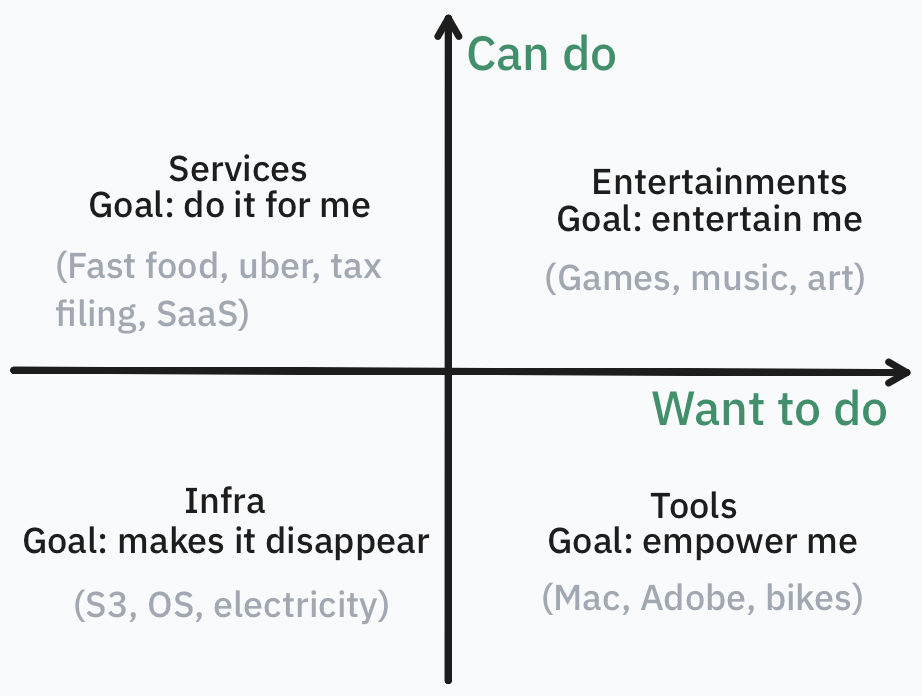

Building software used to be like painting: you need a good idea of what to paint, but most importantly, you need the skill to paint it.

Today, software is going through the shift from painting to photography. Almost everything has changed, and most painting skills are now irrelevant. But some things stay the same: you still need to know what is worth capturing.

This post records my reasoning about what remains valuable in the age of AI.

The ultimate value of everything is to bring joy to breathing humans. 

I break "joy to breathing humans" down along two independent questions: am I able to do a thing, and am I willing to do it? These two axes give four types of valuable things.

{width=50%}

### Can't do, and unwilling to do

**Infra** hides the things we're unable and unwilling to do.

The value of infra is offloading accountability to another **person**. [Machines can never be accountable, so infra must be operated by real humans.](/posts/stop-building-agent-systems/) The value of infra is measured by how much we trust the people who operate it, not the technology or anything else.

AI impact: 

1. It seems everyone can now vibe their own infra, e.g., a custom query engine, table format, or storage engine. But writing the code is one thing; being accountable for it is another. Our ability to write code has grown 100x, but our ability to be accountable for a system has barely changed.
2. The moat of infra is reliability. Cheap and fast matter, but everyone will eventually do well enough: they are measurable, so LLMs can optimize for them. Reliability is a complex mix of engineering and human involvement, and no LLM can train on it.
3. We will learn these lessons slowly and painfully. It might take long enough to kill infra companies that do the right thing.

Infra has a small moat, because all it does is make things disappear. Ultimately, all infra providers are the same, and people can easily switch between them. Airlines, SSD vendors, and today's token providers are critical to our lives, but they are also bad businesses.

Highly profitable infra companies pivot to tooling.

### Can't do, but want to do

**Tools** empower us to do things that would otherwise be hard or impossible.

Good tools are like infra: they hide complexity. But unlike infra, tools are visible. They interact directly with humans and become part of the workflow, which is why they are sticky (moat). 

Infra is easy to build but hard to maintain. Tools are the opposite: extremely hard to build, but they need almost no human effort once built.

AI impact:

1. Many people think they can vibe their own tools, or cute custom software. This might work at a very small scale, but building tools ultimately demands the scarcest human resource: taste. Taste is not measurable, so it can't be trained.
2. LLMs help most those who have taste, and amplify slop for those who don't.
3. Selling tools is much less viable than before. Tooling is becoming more like art: it's very hard to come up with a good one, but once you do, everyone just copies or vibes their own.
4. Tools have less moat than before, because they are increasingly consumed by LLM agents rather than humans. Agents care about functionality, not ergonomics, and functionality is a much simpler problem than ergonomics.

Over time, tooling companies pivot to services.

### Can do, but unwilling to do

**Service** companies do things on your behalf.

Services are like tools: they help you achieve a goal. But tools empower you to achieve it, while services achieve it for you and take it off your mind.

Services are also like infra: they simplify your life by giving you one less thing to pay attention to. But services are customized to each need, often optional, and charge a much higher premium than the underlying infra. Infra is hardcore and generic: something you have to pay for, but not much.

AI impact:

1. It's much more viable to vibe your own services than your own infra.
2. Like infra, the value of services is offloading attention to another person. So services will never go away; instead, they will become more expensive.
3. Unlike tools, services will still be consumed by humans. It makes no sense to offload an LLM agent's attention; agents are cheap and never get tired.

### Can do, and want to do

**Entertainment** is the hardest to automate, because it is always human-to-human. Sure, we love many AI videos and AI art, but we know a human made them. We love seeing a human use AI as a tool to express themselves.

Humans can sense how much human is behind the content. People feel disgusted and disrespected when they find out the content is entirely AI-made.

AI impact:

1. Entertainment has the highest moat: AI alone will never make anything humans appreciate.
2. As a tool, AI can empower individuals to make great content that was never possible before.
3. Entertainment will become much less capital-heavy, and service companies that help talented individuals will become more important. 

### Closing words

Almost every company spans all four quadrants; the two axes are just a way to project a complicated world into familiar language.

Again, the ultimate value is to bring joy to human beings. For most things, **humans have always been the bottleneck**. AI changes a few trade-offs, but not many.
